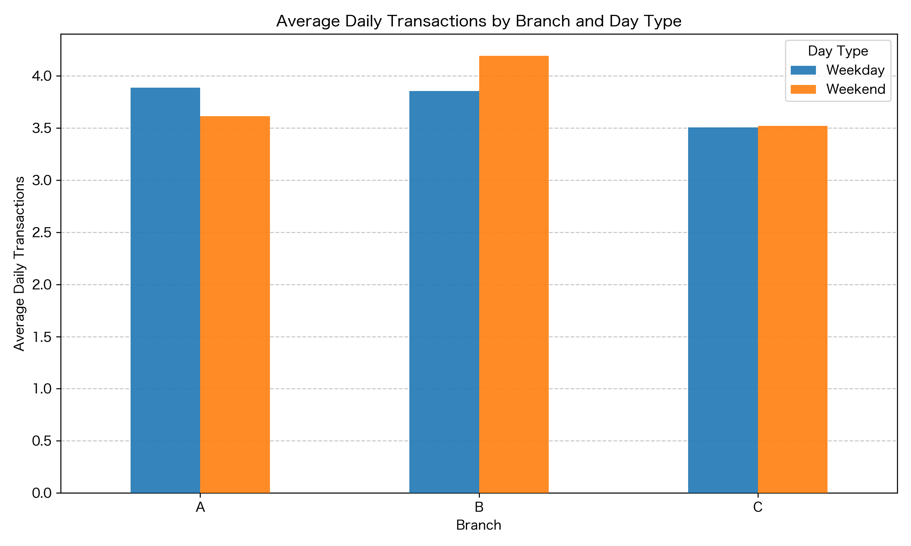
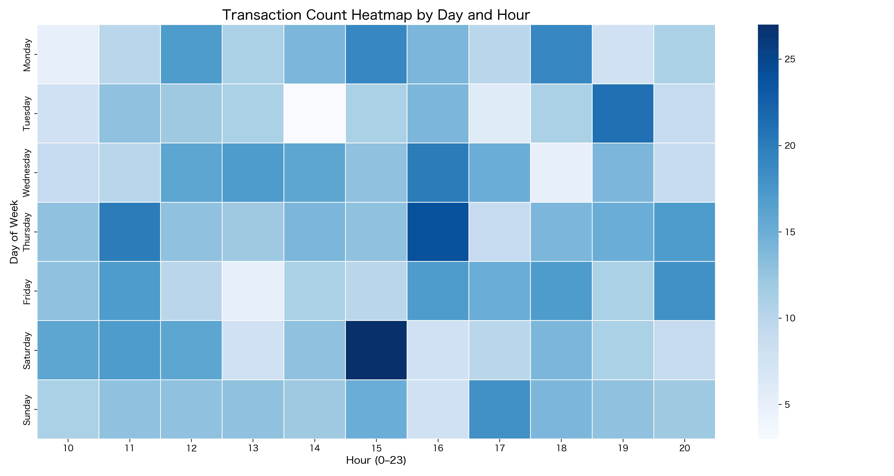
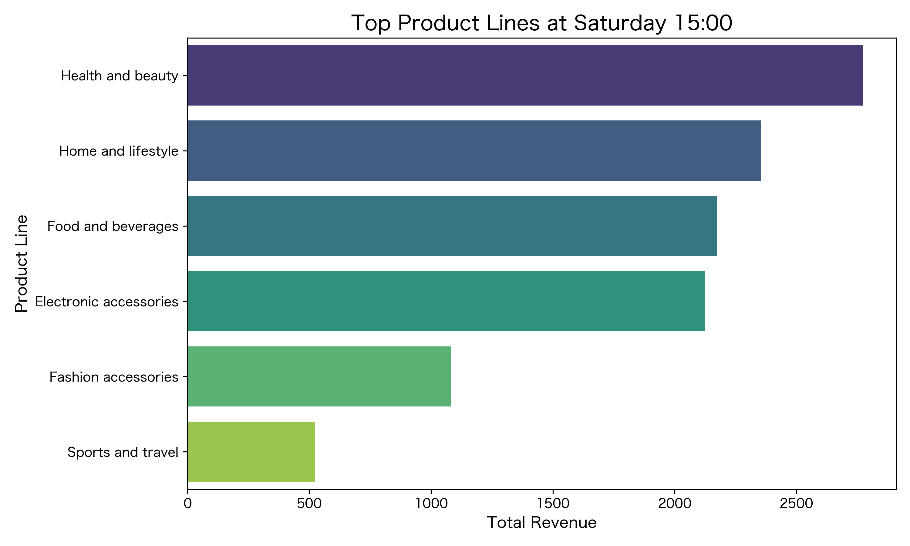

# Supermarket Sales Analysis

## Project Overview
This project analyzes supermarket transaction data using Python to identify peak traffic periods, revenue drivers, and product performance.  
The analysis focuses on understanding when stores are busiest and whether revenue peaks are driven by customer volume (traffic) or spending per transaction (ATV).

## Dataset
Public supermarket sales dataset (CSV format, ~1000 transactions).  
The dataset was obtained from publicly available sources and used for educational and portfolio purposes.

## Tools and Libraries
- Python
- pandas
- matplotlib
- seaborn
- Jupyter Notebook

## Analysis Steps

### 1. Weekday vs Weekend Traffic
Calculated average daily transaction counts per branch to avoid bias from unequal numbers of weekdays and weekends.

### 2. Peak Time Identification
Created a heatmap of transaction counts by day and hour to identify the busiest time slots.

### 3. Revenue Decomposition
Analyzed whether peak revenue periods were driven primarily by:
- Higher customer volume (traffic), or  
- Higher average transaction value (ATV)

Compared peak values with overall averages to quantify the impact.

### 4. Product Performance During Peak Hour
Identified which product lines contributed most to revenue during peak traffic periods.

## Key Findings
- The busiest period occurs on Saturday afternoon.
- Revenue peaks are primarily driven by higher customer volume rather than significantly higher spending per customer.
- Certain product categories contribute disproportionately to peak-hour revenue.

## Example Outputs

### Weekday vs Weekend Traffic

### Traffic Heatmap

### Top Products at Peak Hour

## Business Implications
- Increase staffing during peak traffic periods.
- Optimize product placement for high-performing categories during peak hours.
- Consider targeted promotions during off-peak hours to balance demand.

## Project Structure
supermarket_sales_analysis/

├── data/  
│    supermarket_sales.csv  

├── images/  
│    traffic_weekday_vs_weekend.png  
│    traffic_heatmap.png  
│    top_products_peak_hour.png  

├── supermarket_sales_analysis.ipynb  

└── README.md

## Author
Hannah Yu