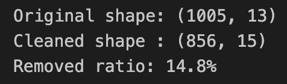

# Supermarket Sales Data Cleaning and Validation

## Project Overview
This project demonstrates a structured data cleaning workflow for transactional retail data.  
The goal is to ensure data quality and reliability before performing business analysis.

The project emphasizes **technical validity, business logic consistency, and analytical readiness**, reflecting real-world data preparation practices.

## Dataset
Supermarket sales dataset containing transactional records such as:

- Invoice ID
- Product line
- Unit price
- Quantity
- Total
- Rating
- Date and Time
- Payment method

## Tools
- Python
- pandas
- NumPy
- Jupyter Notebook

## Data Cleaning Workflow

### 1. Data Inspection
Checked dataset shape, column types, and initial structure.

This ensures schema and data types are suitable for analysis.

### 2. Field Classification
Grouped columns into:
- Identifier fields
- Numeric fields
- Categorical fields
- Datetime fields

This helps define appropriate validation rules.

### 3. Numeric Type Enforcement
Converted numeric fields using:
pd.to_numeric(errors="coerce")

This exposes invalid entries as NaN.

### 4. Business Rule Validation
Validated logical constraints:

- Unit price > 0
- Quantity > 0
- Total > 0
- Rating between 0 and 10

This ensures that values are not only technically valid but also business-realistic.

### 5. Missing Value Strategy
Rows with missing values in core numeric fields were removed to ensure analysis reliability.

Approximately 14.8% of rows were removed.

### 6. Categorical Consistency Check
Checked category values and corrected formatting issues such as leading/trailing spaces.

This ensures consistent grouping during aggregation.

### 7. Datetime Parsing Validation
Confirmed that Date and Time fields could be successfully parsed.

This guarantees accurate time-based analysis.

### 8. Final Sanity Check
Verified:

- No remaining missing values in core fields
- Dataset ready for analysis

This confirms analytical readiness and prevents downstream errors.

## Result
Produced a clean, analysis-ready dataset suitable for downstream analytics.

This project demonstrates a structured, business-aware data cleaning approach rather than aggressive or unnecessary data modification.

## Example Output

### Cleaning Summary

This output summarizes missing value handling and dataset validation results.

## Project Structure
supermarket_sales_data_cleaning/

├── data/  
│    supermarket_sales_dirty.csv  

├── images/  
│    data_cleaning_summary.png  

├── supermarket_sales_data_cleaning.ipynb  

└── README.md

## Author
Hannah Yu