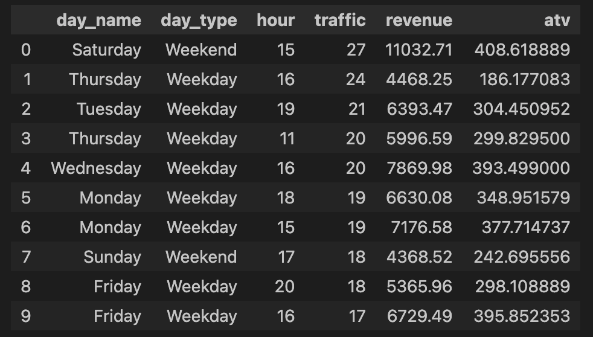

# Supermarket Sales SQL Analysis (DuckDB)

## Project Overview
This project analyzes supermarket sales data using SQL executed through DuckDB in Python.

The goal is to demonstrate SQL skills for business analysis, including aggregation, time-based analysis, and identifying transaction-count and revenue patterns.

DuckDB allows SQL queries to run directly on pandas DataFrames.

## Dataset
Supermarket transaction dataset (CSV format).

Loaded into pandas and registered as a DuckDB table.

## Tools
- Python
- DuckDB
- SQL
- pandas
- Jupyter Notebook

## Analysis Tasks

### 1. Weekday vs Weekend Recorded Transactions
Calculated average daily recorded transaction counts per branch.

Used CTE structure:

- base layer
- feature layer
- aggregation layer

### 2. Peak Time Slot Identification
Identified peak day-hour combinations using:
COUNT(DISTINCT Invoice ID)

Measured:

- transaction count
- revenue
- ATV

### 3. Peak vs Baseline Comparison
Compared peak-slot values to overall averages.

Calculated:

- transaction count ratio
- ATV ratio

This helps determine whether peak revenue is driven more by transaction volume or spending per transaction.

### 4. Ranking Analysis
Used window functions such as:
ROW_NUMBER()

to identify top transaction-count and top ATV periods.

## Key Findings
- Saturday afternoon shows the highest recorded transaction count in the dataset.
- Transaction count increases more significantly than ATV during peak periods.
- Revenue peaks are mainly driven by higher transaction volume.

## Example Output

### SQL Peak Analysis

This output shows peak-slot analysis using SQL aggregation and comparison metrics based on recorded transaction counts in the dataset.

## SQL Concepts Demonstrated
- CTE (WITH clause)
- Aggregation (COUNT, AVG, SUM)
- Date/time parsing
- Window functions
- Ranking
- Business metric calculation

## Project Structure
supermarket_sales_sql_analysis/

├── data/  
│    supermarket_sales.csv  

├── images/  
│    sql_peak_vs_baseline_analysis.png  

├── supermarket_sales_sql_analysis.ipynb  

└── README.md

## Author
Hannah Yu